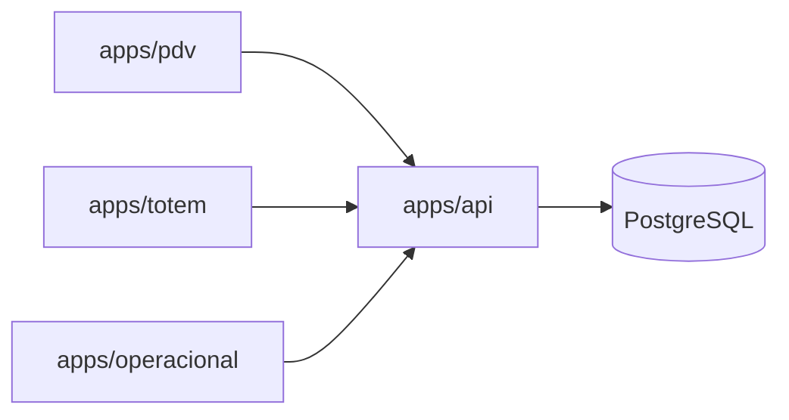

# Estrutura do monorepo — Ligeirinho Hub

Documento alinhado à apresentação do produto (`Ligeirinho-Hub-Apresentacao.pdf`) e ao plano da **Semana 1** (mapeamento do catálogo + setup do PDV).

## Princípios

| Princípio | Implementação |
|-----------|----------------|
| **Uma origem de dados** | PostgreSQL central; API única consumida por PDV, Totem e App |
| **Um pedido, um ID** | `orders.id` / `order_number` compartilhados entre canais |
| **Regras de negócio no hub** | Combos e faixas de preço modelados no banco, aplicados na API |
| **Evolução por módulo** | Apps independentes no monorepo, pacotes compartilhados |

## Árvore de pastas

```
ligeirinho-hub/
├── apps/
│   ├── api/                 # Backend REST/GraphQL — fonte da verdade
│   ├── pdv/                 # Frente de caixa (web/desktop na loja)
│   ├── totem/               # Autoatendimento tablet (PWA)
│   └── operacional/         # App da equipe (fila, preparo, despacho)
├── packages/
│   ├── database/            # Prisma schema, migrations, client
│   ├── shared/              # Tipos, constantes, validadores (Zod)
│   └── pricing/             # Motor de preço/combo (reutilizado API + PDV)
├── docs/
│   ├── arquitetura/
│   └── database/
├── site/                    # Landing institucional (já existente)
├── Ligeirinho-Hub-Apresentacao.pdf
├── package.json             # npm workspaces
└── README.md
```

## Responsabilidade por pasta

### `apps/api`

- CRUD de catálogo (categorias, produtos, combos, faixas de preço)
- Ciclo de vida do pedido (`NOVO` → `EM_PREPARACAO` → `EM_ROTA` → `CONCLUIDO`)
- Cálculo de carrinho (tiers + combos) e split de pagamento
- Webhooks / sync Cayena → Active Entregas (Semana 3+)

**Stack sugerida (Semana 1):** Node.js + Fastify ou NestJS + Prisma.

### `apps/pdv`

- Busca rápida de produtos (SKU, nome, código de barras)
- Carrinho, descontos progressivos e combos
- Split de pagamento (múltiplos `order_payments`)
- Impressão / fechamento de caixa (fases posteriores)

**Stack sugerida:** React + Vite (mesmo padrão do `site/`), modo kiosk fullscreen.

### `apps/totem`

- Navegação por categorias (Cervejas, Destilados, …)
- Layout visual orientado a conversão
- Envio do pedido direto para a fila (`channel = TOTEM`)

**Stack sugerida:** React PWA, touch-first, offline leve (cache de cardápio).

### `apps/operacional`

- Painel por status: Novos, Em preparação, Em rota, Concluídos
- Atribuição de preparador (`assigned_to_id`)
- Integração motorista / Active (Semana 3)

**Stack sugerida:** React PWA ou React Native (se app nativo for requisito).

### `packages/database`

- `prisma/schema.prisma` — modelagem central
- Migrations versionadas
- Seed de catálogo piloto (cervejas, destilados, exemplos de tier)

### `packages/shared`

- Enums espelhando o Prisma (`OrderStatus`, `OrderChannel`, …)
- DTOs e schemas de validação compartilhados entre apps

### `packages/pricing`

- Função pura: dado produto + quantidade (+ canal), retorna `unitPriceCents` e rótulo da faixa
- Regras de combo (bundle fixo, mix-and-match, tier no combo)
- Usada na API e, se necessário, pré-visualização offline no PDV

## Fluxo de dados (Semana 1)



## Convenções

- **IDs:** UUID v4 no banco; `order_number` legível para operação (`LH-YYYYMMDD-NNNN`)
- **Dinheiro:** sempre inteiro em **centavos** (`*_cents`) — evita float
- **Snapshots:** itens do pedido guardam preço e nome no momento da venda
- **Branches Git:** `cursor/<feature>-99e6` para trabalho do agente; `main` estável

## Próximos passos após este setup

1. Implementar `apps/api` com endpoints de catálogo e criação de pedido PDV
2. Seed real do cardápio Ligeirinho (planilha de mapeamento Semana 1)
3. Scaffold `apps/pdv` com busca e carrinho consumindo a API
4. Totem e App operacional nas semanas 2 e 3 do cronograma
