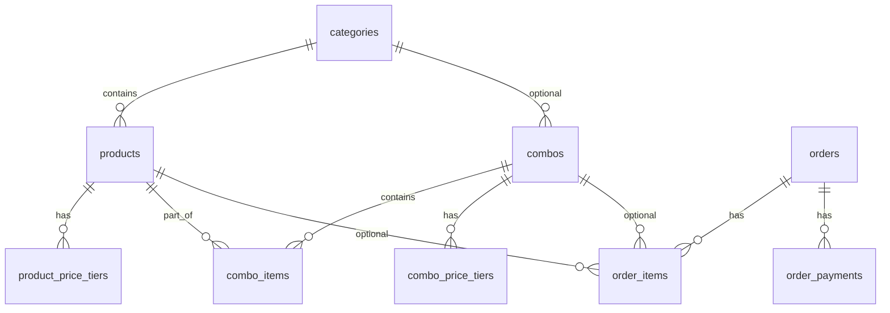

# Modelagem inicial do banco — Ligeirinho Hub

PostgreSQL + Prisma (`packages/database/prisma/schema.prisma`).

## Entidades principais (Semana 1)

### Catálogo

| Tabela | Papel |
|--------|--------|
| `categories` | Árvore de categorias (Cervejas, Destilados, …); flags `show_on_totem` |
| `products` | SKU, nome, preço base opcional, vínculo com categoria |
| `product_price_tiers` | **Preços dinâmicos por quantidade** |
| `combos` | Pacotes / regras promocionais |
| `combo_items` | Produtos que compõem um combo |
| `combo_price_tiers` | Faixas de preço no nível do combo (opcional) |

### Pedidos

| Tabela | Papel |
|--------|--------|
| `orders` | Pedido único com `channel` (PDV, TOTEM, APP, CAYENA) e `status` operacional |
| `order_items` | Linhas com snapshot de preço e nome |
| `order_payments` | Split de pagamento (vários métodos por pedido) |

## Preços dinâmicos por quantidade

Exemplo do PDF / regra de negócio: **1 un = R$ 7,50** e **3+ un = R$ 4,50/un**.

Registro em `product_price_tiers`:

| product_id | min_quantity | max_quantity | unit_price_cents | label |
|------------|--------------|--------------|------------------|-------|
| `{cerveja_x}` | 1 | 2 | 750 | Varejo |
| `{cerveja_x}` | 3 | NULL | 450 | Atacado 3+ |

**Algoritmo de resolução (pacote `pricing`):**

1. Filtrar tiers ativos do produto, dentro de `valid_from` / `valid_until` se definidos
2. Selecionar o tier onde `quantity >= min_quantity` e (`max_quantity` IS NULL ou `quantity <= max_quantity`)
3. Em empate, usar maior `priority`, depois maior `min_quantity`
4. Se nenhum tier aplicar, usar `products.base_price_cents`

```sql
-- Exemplo conceitual
SELECT * FROM product_price_tiers
WHERE product_id = $1 AND active = true
  AND min_quantity <= $qty
  AND (max_quantity IS NULL OR max_quantity >= $qty)
ORDER BY priority DESC, min_quantity DESC
LIMIT 1;
```

## Combos

| `ComboType` | Uso |
|-------------|-----|
| `FIXED_BUNDLE` | Combo fechado (ex: "Kit churrasco") com `fixed_price_cents` ou soma dos itens |
| `QUANTITY_TIER` | Promoção ligada a quantidade no nível do combo |
| `MIX_AND_MATCH` | Cliente escolhe N itens entre alternativas (`combo_items.group_key`, `min_pick` / `max_pick`) |

Itens obrigatórios vs opcionais: `combo_items.is_required`.

## Pedido e snapshot

Ao fechar o carrinho, cada `order_items` grava:

- `unit_price_cents` e `line_total_cents` calculados na hora
- `product_name_snapshot` e `price_tier_label` (ex: "Atacado 3+")
- `pricing_rule_snapshot` (JSON opcional com tier/combo aplicados) para auditoria

Assim alterações futuras no cardápio não reescrevem histórico.

## Status e canais

**`OrderChannel`:** `PDV` | `TOTEM` | `APP` | `CAYENA` | `WHATSAPP`

**`OrderStatus`:** `NOVO` → `EM_PREPARACAO` → `EM_ROTA` → `CONCLUIDO` (e `CANCELADO`)

Totem e PDV criam pedidos que aparecem como `NOVO` no App operacional.

## Split de pagamento

Vários registros em `order_payments` por `order_id`:

```
Pedido total R$ 50,00
  - PIX     R$ 30,00
  - Dinheiro R$ 20,00
```

A API valida `SUM(amount_cents) = orders.total_cents` no fechamento.

## Diagrama ER (simplificado)



## Comandos

```bash
# Na raiz do monorepo
cp packages/database/.env.example packages/database/.env
# Editar DATABASE_URL

npm install
npm run db:generate
npm run db:migrate
```

## Evolução planejada (fora do escopo Semana 1)

- `users` / `roles` (caixa, preparador, motorista)
- `inventory_movements` (estoque)
- `integration_cayena_orders` (espelho externo)
- `stores` (multi-loja)
